# SƠ ĐỒ CHỨC NĂNG HỆ THỐNG WEB NOVEL PLATFORM

## 1. TỔNG QUAN HỆ THỐNG

Hệ thống Web Novel Platform là một nền tảng đọc truyện trực tuyến với các tính năng quản lý nội dung, gợi ý thông minh, và phân quyền người dùng. Hệ thống được xây dựng trên nền tảng Next.js với kiến trúc phân tầng rõ ràng.

## 2. SƠ ĐỒ PHÂN CẤP CHỨC NĂNG

```mermaid
graph TB
    System[Web Novel Platform]
    
    System --> Auth[Module Xác Thực & Phân Quyền]
    System --> Main[Module Người Dùng Chính]
    System --> Admin[Module Quản Trị]
    
    %% Authentication Module
    Auth --> Auth1[Đăng ký / Đăng nhập]
    Auth --> Auth2[Quên mật khẩu]
    Auth --> Auth3[Đặt lại mật khẩu]
    Auth --> Auth4[Onboarding - Chọn sở thích]
    Auth --> Auth5[Phân quyền: User/Moderator/Admin]
    
    %% Main User Module
    Main --> Main1[Trang Chủ]
    Main --> Main2[Tìm Kiếm & Khám Phá]
    Main --> Main3[Thư Viện Cá Nhân]
    Main --> Main4[Đọc Truyện & Tương Tác]
    Main --> Main5[Hồ Sơ Người Dùng]
    
    Main1 --> Main1a[Hero Section - Banner]
    Main1 --> Main1b[Trending Stories - Top xu hướng]
    Main1 --> Main1c[Latest Updates - Cập nhật mới]
    Main1 --> Main1d[Genre Grid - Lưới thể loại]
    Main1 --> Main1e[Recommendations - Gợi ý cá nhân]
    Main1 --> Main1f[Statistics Bar - Thống kê]
    
    Main2 --> Main2a[Search Bar - Tìm kiếm]
    Main2 --> Main2b[Filter - Lọc theo thể loại]
    Main2 --> Main2c[Sort - Sắp xếp kết quả]
    
    Main3 --> Main3a[Favorites - Truyện yêu thích]
    Main3 --> Main3b[History - Lịch sử đọc]
    Main3 --> Main3c[Bookmarks - Đánh dấu]
    
    Main4 --> Main4a[Story Info - Thông tin truyện]
    Main4 --> Main4b[Chapter List - Danh sách chương]
    Main4 --> Main4c[Comments - Bình luận]
    Main4 --> Main4d[Rating - Đánh giá]
    Main4 --> Main4e[Similar Stories - Truyện tương tự]
    
    Main5 --> Main5a[Profile Settings - Cài đặt]
    Main5 --> Main5b[Change Password - Đổi mật khẩu]
    Main5 --> Main5c[User Analytics - Phân tích hoạt động]
    
    %% Admin Module
    Admin --> Admin1[Dashboard Overview]
    Admin --> Admin2[Quản Lý Crawl]
    Admin --> Admin3[Quản Lý Truyện]
    Admin --> Admin4[Quản Lý Người Dùng]
    Admin --> Admin5[Giám Sát Hệ Thống]
    Admin --> Admin6[Metrics & Analytics]
    
    Admin1 --> Admin1a[Thống kê tổng quan]
    Admin1 --> Admin1b[Biểu đồ hoạt động]
    
    Admin2 --> Admin2a[Quick Crawl - Crawl nhanh]
    Admin2 --> Admin2b[Monitor Jobs - Giám sát công việc]
    Admin2 --> Admin2c[Retry/Delete Jobs]
    Admin2 --> Admin2d[Auto-refresh status]
    
    Admin3 --> Admin3a[Story Management - CRUD]
    Admin3 --> Admin3b[Chapter Editor - Rich Text]
    Admin3 --> Admin3c[Image Upload - Cloudinary]
    Admin3 --> Admin3d[Publish/Unpublish]
    
    Admin4 --> Admin4a[User List - Danh sách]
    Admin4 --> Admin4b[Role Management - Phân quyền]
    Admin4 --> Admin4c[Ban/Unban Users]
    
    Admin5 --> Admin5a[System Config - Cấu hình]
    Admin5 --> Admin5b[Logs - Nhật ký hệ thống]
    
    Admin6 --> Admin6a[User Metrics - Thống kê người dùng]
    Admin6 --> Admin6b[Content Metrics - Thống kê nội dung]
    Admin6 --> Admin6c[Performance Metrics]
    
    style System fill:#ff6b6b,stroke:#c92a2a,stroke-width:3px,color:#fff
    style Auth fill:#4ecdc4,stroke:#0a9396,stroke-width:2px
    style Main fill:#45b7d1,stroke:#0077b6,stroke-width:2px
    style Admin fill:#f77f00,stroke:#d62828,stroke-width:2px
```



## 3. MÔ TẢ CÁC MODULE CHÍNH

### 3.1. Module Xác Thực & Phân Quyền

- **Đăng ký/Đăng nhập:** Tạo tài khoản và xác thực người dùng
- **Quên/Đặt lại mật khẩu:** Khôi phục tài khoản qua email
- **Onboarding:** Thu thập sở thích thể loại của người dùng mới để phục vụ gợi ý
- **Phân quyền (RBAC):** 3 vai trò - USER (đọc truyện), MODERATOR (quản lý nội dung), ADMIN (toàn quyền)

### 3.2. Module Người Dùng Chính

- **Trang Chủ:** Hero banner, Trending stories, Latest updates, Genre grid, Recommendations (cá nhân hóa), Statistics bar
- **Tìm Kiếm & Khám Phá:** Search bar, Filter theo thể loại/trạng thái/rating, Sort options
- **Thư Viện Cá Nhân:** Favorites, Reading history với tiến độ, Bookmarks
- **Đọc Truyện & Tương Tác:** Story info, Chapter list, Reader (điều chỉnh font/theme), Comments, Rating, Similar stories
- **Hồ Sơ:** User info, Analytics (phân tích thói quen đọc), Settings

### 3.3. Module Quản Trị

- **Dashboard Overview:** Thống kê tổng quan, Biểu đồ hoạt động
- **Quản Lý Crawl:** Quick crawl từ Syosetu.com, Monitor jobs (auto-refresh 5s), Retry/Delete jobs, Phân quyền xem theo role
- **Quản Lý Truyện:** CRUD operations, Rich text editor (Tiptap), Image upload (Cloudinary), Chapter editor, Metadata management
- **Quản Lý Người Dùng:** User list, Role management (promote/demote), Ban/Unban users
- **Giám Sát & Metrics:** System config, Logs, User/Content/Performance metrics

## 4. HỆ THỐNG GỢI Ý THÔNG MINH

### 4.1. Các Loại Gợi Ý

**a) Homepage Recommendations ("Có thể bạn sẽ thích")**
- Chỉ hiển thị cho user đã đăng nhập
- Thuật toán: Hybrid (Content-based + Collaborative + Trending)

**b) Similar Stories ("Truyện tương tự")**
- Hiển thị tại Story Detail Page
- Hỗ trợ cả authenticated và anonymous users
- Thuật toán: Semantic Similarity + Genre-based

**c) Cold Start Recommendations**
- Dành cho user mới, chưa có lịch sử
- Dựa trên sở thích được chọn trong Onboarding
- Thuật toán: Genre-based + Popular in categories

### 4.2. Thuật Toán Gợi Ý

Hệ thống sử dụng **Hybrid Algorithm** kết hợp:
1. **Content-Based Filtering:** Dựa trên đặc tính truyện (thể loại, tags, mô tả)
2. **Collaborative Filtering:** Dựa trên hành vi người dùng (lịch sử đọc, rating)
3. **Trending Algorithm:** Truyện phổ biến (lượt xem, rating, bình luận)
4. **Semantic Similarity:** Tương đồng ngữ nghĩa (NLP embeddings)

## 5. PHÂN TÍCH ROLE-BASED ACCESS CONTROL (RBAC)

| Chức năng | USER | MODERATOR | ADMIN |
|-----------|------|-----------|-------|
| **Đọc truyện** | ✅ | ✅ | ✅ |
| **Bình luận, đánh giá** | ✅ | ✅ | ✅ |
| **Thư viện cá nhân** | ✅ | ✅ | ✅ |
| **Nhận gợi ý cá nhân** | ✅ | ✅ | ✅ |
| **Truy cập Dashboard** | ❌ | ✅ | ✅ |
| **Crawl truyện** | ❌ | ✅ | ✅ |
| **Xem own crawl jobs** | ❌ | ✅ | ✅ |
| **Xem ALL crawl jobs** | ❌ | ❌ | ✅ |
| **Quản lý truyện (CRUD)** | ❌ | ✅ | ✅ |
| **Delete crawl jobs** | ❌ | ❌ | ✅ |
| **Quản lý users** | ❌ | ❌ | ✅ |
| **Ban/Unban users** | ❌ | ❌ | ✅ |
| **Change user roles** | ❌ | ❌ | ✅ |
| **System config** | ❌ | ❌ | ✅ |
| **View all metrics** | ❌ | ❌ | ✅ |

## 6. CÔNG NGHỆ & KIẾN TRÚC

### 6.1. Tech Stack

**Frontend:** Next.js 14, React 18, TypeScript, Tailwind CSS

**State Management:** Zustand, React Context, Custom Hooks

**API Integration:** OpenAPI Generated Client, Rate Limit Handling

**Rich Content:** Tiptap Editor, Cloudinary

**Code Quality:** ESLint, TypeScript strict mode

### 6.2. Cấu trúc Routing

```
app/
├── (auth)/      # Đăng ký, đăng nhập, onboarding
├── (main)/      # Trang chủ, search, library, story detail, profile
└── (admin)/     # Dashboard quản trị
```

## 7. KẾT LUẬN

### 7.1. Điểm Mạnh

1. **Phân quyền chặt chẽ:** RBAC với 3 roles rõ ràng
2. **Gợi ý thông minh:** Hybrid algorithm kết hợp nhiều kỹ thuật ML
3. **UX tối ưu:** Responsive design, real-time updates
4. **Quản trị mạnh mẽ:** Crawl automation, rich text editor, analytics

### 7.2. Phạm vi Ứng dụng

- Nền tảng đọc truyện online quy mô vừa đến lớn
- Hệ thống content-rich với nhu cầu recommendation
- Platform cần crawl và quản lý nội dung tự động

### 7.3. Khả năng Mở rộng

- Tích hợp mạng xã hội (follow authors, social sharing)
- Hệ thống thanh toán cho premium content
- Mobile app (React Native/Flutter)
- Real-time notifications (WebSocket)
- Multi-language support (i18n)

---

**Ghi chú:** Sơ đồ này được thiết kế cho phần phân tích yêu cầu trong báo cáo project. Sơ đồ Mermaid có thể render trực tiếp trong Markdown viewers hỗ trợ.
